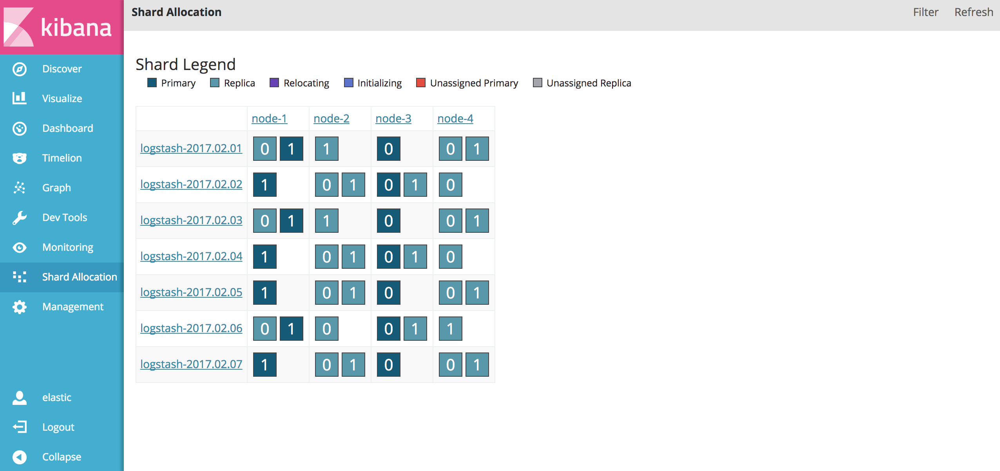

# Elasticsearch Shards Allocation Visualization
A kibana plugin adding app that visualize elasticsearch shard allocation



## Compatibility
This plugin support kibana 5. check [releases](https://github.com/asileon/kibana_shard_allocation/releases) for the tested versions.

## Installation

### Kibana 5.1.2:
```
bin/kibana-plugin install https://github.com/asileon/kibana_shard_allocation/releases/download/v5.1.2.1/release.zip
```

#### for other kibana versions that are missing releases try the following:
* extract the source code into a new folder named `kibana_shard_allocation` in your `kibana/plugins` folder
* edit `package.json` file and set `version` field to your kibana version

## Uninstall

### Kibana 5.x:
```
bin/kibana-plugin remove kibana_shard_allocation
```
